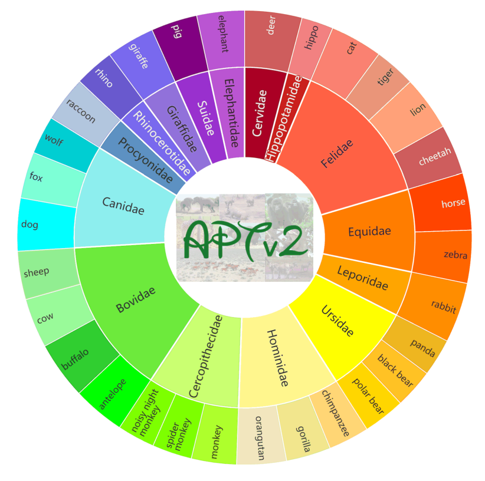
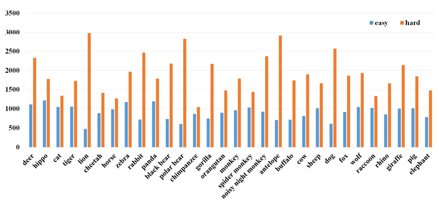
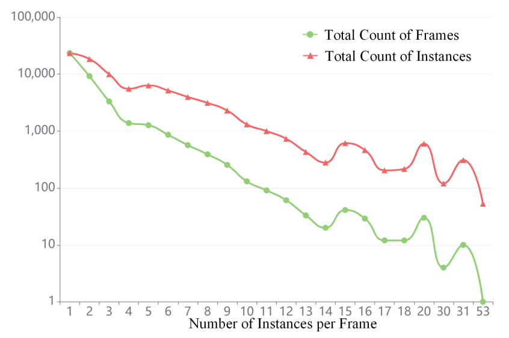

# APTv2
This repo is the official implementation of ["APTv2: Benchmarking Animal Pose Estimation and Tracking with a Large-scale Dataset and Beyond"](https://arxiv.org/pdf/2312.15612).

### Introduction
Animal Pose Estimation and Tracking (APT) is a critical task in detecting and monitoring the keypoints of animals across a series of video frames, which is essential for understanding animal behavior. Past works relating to animals have primarily focused on either animal tracking or single-frame animal pose estimation only, neglecting the integration of both aspects. The absence of comprehensive APT datasets inhibits the progression and evaluation of animal pose estimation and tracking methods based on videos, thereby constraining their real-world applications. To fill this gap, we introduce APTv2, the pioneering large-scale benchmark for animal pose estimation and tracking. APTv2 comprises 2,749 video clips filtered and collected from 30 distinct animal species. Each video clip includes 15 frames, culminating in a total of 41,235 frames. Following meticulous manual annotation and stringent verification, we provide high-quality keypoint and tracking annotations for a total of 84,611 animal instances, split into easy and hard subsets based on the number of instances that exists in the frame. With APTv2 as the foundation, we establish a simple baseline method named ViTPoseTrack and provide benchmarks for representative models across three tracks: (1) single-frame animal pose estimation track to evaluate both intra- and inter-domain transfer learning performance, (2) low-data transfer and generalization track to evaluate the inter-species domain generalization performance, and (3) animal pose tracking track. Our experimental results deliver key empirical insights, demonstrating that APTv2 serves as a valuable benchmark for animal pose estimation and tracking. It also presents new challenges and opportunities for future research.

  

## Supervised Results with Pretrained Models
| method | model | pretrain | AP | config | weight |
| :---: | :---: | :---: | :---: |  :---: |  :---: |
| SimBa | Res-50 | IN1k | 64.1 | [config](configs/animal/2d_kpt_sview_rgb_img/topdown_heatmap/aptv2/res50_ap10k_256x256.py) | [Onedrive](https://1drv.ms/u/s!AimBgYV7JjTlgckAOmQe7NBvwCNk8Q?e=9q0Kd2) |
| SimBa | Res-50 | COCO | 67.8 | [config](configs/animal/2d_kpt_sview_rgb_img/topdown_heatmap/aptv2/res50_ap10k_256x256.py) | [Onedrive](https://1drv.ms/u/s!AimBgYV7JjTlgchFTIgrhvwHdRhMmg?e=dnW2sg) |
| SimBa | Res-50 | AP-10K | 66.3 | [config](configs/animal/2d_kpt_sview_rgb_img/topdown_heatmap/aptv2/res50_ap10k_256x256.py) | [Onedrive](https://1drv.ms/u/s!AimBgYV7JjTlgckEbsFw89vbdRf9Dg?e=wCkiCi) |
| SimBa | Res-101 | IN1k | 65.3 | [config](configs/animal/2d_kpt_sview_rgb_img/topdown_heatmap/aptv2/res101_ap10k_256x256.py) | [Onedrive](https://1drv.ms/u/s!AimBgYV7JjTlgckBZSfp47QM0IypEw?e=oGGo2f) |
| SimBa | Res-101 | COCO | 68.1 | [config](configs/animal/2d_kpt_sview_rgb_img/topdown_heatmap/aptv2/res101_ap10k_256x256.py) | [Onedrive](https://1drv.ms/u/s!AimBgYV7JjTlgchPzLjS8dc5gGMR9g?e=XzJ8SJ) |
| SimBa | Res-101 | AP-10K | 64.6 | [config](configs/animal/2d_kpt_sview_rgb_img/topdown_heatmap/aptv2/res101_ap10k_256x256.py) | [Onedrive](https://1drv.ms/u/s!AimBgYV7JjTlgckGDrXagCi5RZfntw?e=8htWSS) |
| HRNet | HR-w32 | IN1k | 68.5 | [config](configs/animal/2d_kpt_sview_rgb_img/topdown_heatmap/aptv2/hrnet_w32_ap10k_256x256.py) | [Onedrive](https://1drv.ms/u/s!AimBgYV7JjTlgchYd0QgAEDD5E709Q?e=aoRDnE) |
| HRNet | HR-w32 | COCO | 70.1 | [config](configs/animal/2d_kpt_sview_rgb_img/topdown_heatmap/aptv2/hrnet_w32_ap10k_256x256.py) | [Onedrive](https://1drv.ms/u/s!AimBgYV7JjTlgchWiiB_bHb7NmXtBQ?e=bbeiUV) |
| HRNet | HR-w32 | AP-10K | 69.8 | [config](configs/animal/2d_kpt_sview_rgb_img/topdown_heatmap/aptv2/hrnet_w32_ap10k_256x256.py) | [Onedrive](https://1drv.ms/u/s!AimBgYV7JjTlgckDj3XByy1GgOZy3Q?e=y0N7ZD) |
| HRNet | HR-w48 | IN1k | 70.1 | [config](configs/animal/2d_kpt_sview_rgb_img/topdown_heatmap/aptv2/hrnet_w48_ap10k_256x256.py) | [Onedrive](https://1drv.ms/u/s!AimBgYV7JjTlgckCMbENmrSEbQvRxg?e=xrqcJ0) |
| HRNet | HR-w48 | COCO | 71.7 | [config](configs/animal/2d_kpt_sview_rgb_img/topdown_heatmap/aptv2/hrnet_w48_ap10k_256x256.py) | [Onedrive](https://1drv.ms/u/s!AimBgYV7JjTlgchSN8RuXV5tK65jsA?e=hN5iDw) |
| HRNet | HR-w48 | AP-10K | 71.2 | [config](configs/animal/2d_kpt_sview_rgb_img/topdown_heatmap/aptv2/hrnet_w48_ap10k_256x256.py) | [Onedrive](https://1drv.ms/u/s!AimBgYV7JjTlgckFCZfuiccSy2slxw?e=XJ2bhY) |
| HRFormer | HRFomer-S | IN1k | 67.0 | [config](configs/animal/2d_kpt_sview_rgb_img/topdown_heatmap/aptv2/hrformer_small_ap10k_256x256.py) | [Onedrive](https://1drv.ms/u/s!AimBgYV7JjTlgchJnbUn_wBJF_eliA?e=QKmpsK) |
| HRFormer | HRFomer-S | COCO | 69.5 | [config](configs/animal/2d_kpt_sview_rgb_img/topdown_heatmap/aptv2/hrformer_small_ap10k_256x256.py) | [Onedrive](https://1drv.ms/u/s!AimBgYV7JjTlgchKZxoiv0tkcSHsUQ?e=NSHfkI) |
| HRFormer | HRFomer-S | AP-10K | 67.2 | [config](configs/animal/2d_kpt_sview_rgb_img/topdown_heatmap/aptv2/hrformer_small_ap10k_256x256.py) | [Onedrive](https://1drv.ms/u/s!AimBgYV7JjTlgchMPgO-VOLq4u35AQ?e=7hFZEW) |
| HRFormer | HRFomer-B | IN1k | 69.0 | [config](configs/animal/2d_kpt_sview_rgb_img/topdown_heatmap/aptv2/hrformer_base_ap10k_256x256.py) | [Onedrive](https://1drv.ms/u/s!AimBgYV7JjTlgchZcM46mhVsu5XOdQ?e=NVMFMr) |
| HRFormer | HRFomer-B | COCO | 69.7 | [config](configs/animal/2d_kpt_sview_rgb_img/topdown_heatmap/aptv2/hrformer_base_ap10k_256x256.py) | [Onedrive](https://1drv.ms/u/s!AimBgYV7JjTlgchaMOhVh4RL-of6Hw?e=9dG3cO) |
| HRFormer | HRFomer-B | AP-10K | 69.6 | [config](configs/animal/2d_kpt_sview_rgb_img/topdown_heatmap/aptv2/hrformer_base_ap10k_256x256.py) | [Onedrive](https://1drv.ms/u/s!AimBgYV7JjTlgchbQRrVhmiyfzJyOQ?e=gaL4DA) |
| ViTPose | ViTPose-B | IN1k | 72.4 | [config](configs/animal/2d_kpt_sview_rgb_img/topdown_heatmap/aptv2/vit_base_ap10k_256x256.py) | [Onedrive](https://1drv.ms/u/s!AimBgYV7JjTlgchrHvIRUeTAIsgPdA?e=x9GHmo) |
| ViTPose | ViTPose-B | COCO | 72.4 | [config](configs/animal/2d_kpt_sview_rgb_img/topdown_heatmap/aptv2/vit_base_ap10k_256x256.py) | [Onedrive](https://1drv.ms/u/s!AimBgYV7JjTlgchpqw4ZCRw98aZSzA?e=PIyR3b) |
| ViTPose | ViTPose-B | AP-10K | 72.4 | [config](configs/animal/2d_kpt_sview_rgb_img/topdown_heatmap/aptv2/vit_base_ap10k_256x256.py) | [Onedrive](https://1drv.ms/u/s!AimBgYV7JjTlgchqa3vP3AGNmoNH6Q?e=ZP5sWx) |

## Zero-Shot Results
| model | pretrain | Canidae | Felidae | Hominidae | Cercopithecidae | Ursidae | Bovidae | Average | weight |
| :---: | :---: | :---: | :---: |  :---: |  :---: |:---: | :---: | :---: | :---: |
| HRNet-w32 | AP10K | 59.6 | 64.5 | 42.2 | 38.6 | 51.6 | 58.7 | 52.5 | [Onedrive](https://1drv.ms/u/s!AimBgYV7JjTlgchvjxPK4UmNFssrcw?e=YU29YG) |
| ViTPose-B | AP10K | 63.9 | 65.5 | 47.5 | 51.0 | 59.0 | 59.0 | 57.7 | [Onedrive](https://1drv.ms/u/s!AimBgYV7JjTlgchwU1u4_vjsmtpNEg?e=UH64O2) |
| ViTPose-L | AP10K | 66.0 | 69.1 | 59.9 | 61.0 | 62.4 | 61.0 | 63.2 | [Onedrive](https://1drv.ms/u/s!AimBgYV7JjTlgchxFqeW4D-3HoSBnw?e=Mrdgje) |

## Leave-One-Out Results of HRNet-w32 (both easy and hard)
| setting | Canidae | Felidae | Hominidae | Cercopithecidae | Ursidae | Bovidae | weight |
| :---: | :---: | :---: | :---: |  :---: |  :---: |:---: | :---: | 
| w/o Canidae | 66.1 | 77.8 | 68.8 | 66.3 | 75.4 | 68.3 | [Onedrive](https://1drv.ms/u/s!AimBgYV7JjTlgcg7jCTlNVpr_SuQsQ?e=tIbPrj) |
| w/o Felidae | 74.4 | 68.1 | 68.9 | 67.8 | 76.1 | 66.8 | [Onedrive](https://1drv.ms/u/s!AimBgYV7JjTlgcheqKRMFdwmDhmkBw?e=4eAyoV) |
| w/o Hominidae | 74.2 | 77.4 | 49.7 | 65.5 | 75.9 | 67.4 | [Onedrive](https://1drv.ms/u/s!AimBgYV7JjTlgchd8PQVVZdK9EB96g?e=EQ479z) |
| w/o Cercopithecidae | 75.2 | 79.0 | 68.6 | 45.0 | 76.2 | 67.7 | [Onedrive](https://1drv.ms/u/s!AimBgYV7JjTlgcg6YkV5IDPn_dowJw?e=1P5qNg) |
| w/o Ursidae | 74.2 | 77.9 | 69.9 | 66.4 | 51.3 | 67.6 | [Onedrive](https://1drv.ms/u/s!AimBgYV7JjTlgcg5YLeXvd2LQOt5Ag?e=4bYlCn) |
| w/o Bovidae | 74.0 | 77.4 | 69.3 | 66.8 | 76.9 | 59.5 | [Onedrive](https://1drv.ms/u/s!AimBgYV7JjTlgchcUBM6MjH0OX6MvQ?e=dJSvNf) |

## Leave-One-Out Results of HRNet-w32 (only easy)
| setting | Canidae | Felidae | Hominidae | Cercopithecidae | Ursidae | Bovidae | weight |
| :---: | :---: | :---: | :---: |  :---: |  :---: |:---: | :---: | 
| w/o Canidae | 55.9 | 68.0 | 63.2 | 60.8 | 61.8 | 55.9 | [Onedrive](https://1drv.ms/u/s!AimBgYV7JjTlgchmCzOnm6SYrPEXiA?e=uiLeR4) |
| w/o Felidae | 62.1 | 59.5 | 64.6 | 60.9 | 61.7 | 56.0 | [Onedrive](https://1drv.ms/u/s!AimBgYV7JjTlgchhpwm6XJ0dS2pK6g?e=3osALf) |
| w/o Hominidae | 62.6 | 70.1 | 47.0 | 55.3 | 61.3 | 57.5 | [Onedrive](https://1drv.ms/u/s!AimBgYV7JjTlgchj_rO5j6XiXupMcg?e=bsfVKG) |
| w/o Cercopithecidae | 62.6 | 69.1 | 62.9 | 38.1 | 61.9 | 56.0 | [Onedrive](https://1drv.ms/u/s!AimBgYV7JjTlgchkJaJQgEqN7PLyWQ?e=Z4Z8ck) |
| w/o Ursidae | 62.5 | 69.7 | 64.6 | 60.5 | 45.2 | 55.7 | [Onedrive](https://1drv.ms/u/s!AimBgYV7JjTlgchiTpoUFwOd3fEzvg?e=KK2P1l) |
| w/o Bovidae | 61.8 | 69.5 | 65.0 | 59.9 | 63.4 | 50.9 | [Onedrive](https://1drv.ms/u/s!AimBgYV7JjTlgchlEc80fNM2snOZzg?e=21y8AH) |

## Tracking Results Pretrained on GOT10K
| tracker | Res-50 | Res-101 | HR-w32 | HR-w48 | HRFormer-S | HRFormer-B | ViTPose-B | ViTPose-L | Avg. | weight |
| :---: | :---: | :---: | :---: |  :---: |  :---: |:---: | :---: | :---: | :---: | :---: |
| ViTTrack | 65.9 | 66.0 | 68.2 | 69.5 | 67.6 | 67.7 | 70.2 | 72.2 | 68.4 | [Onedrive](https://1drv.ms/u/s!AimBgYV7JjTlgcg0VmNmB40kLw8h9w?e=oKGS8y) |
| ViTPoseTrack-B | 65.3 | 65.6 | 67.9 | 69.1 | 66.9 | 67.1 | 69.7 | 71.9 | 67.9 | [Onedrive](https://1drv.ms/u/s!AimBgYV7JjTlgcg1Efjqgk-FoqFQjQ?e=dKMXh5) |
| ViTPoseTrack-L | 65.9 | 66.0 | 68.3 | 69.6 | 67.5 | 67.6 | 70.2 | 72.4 | 68.4 | [Onedrive](https://1drv.ms/u/s!AimBgYV7JjTlgcg2OZq0LO5GejpuIQ?e=JXtocd) |

## Installation
Please refer to [install.md](docs/en/install.md) for installation guide.

## Get Started
Download the data for [APTv2](https://1drv.ms/f/s!AimBgYV7JjTlgckmLjVg2Z7B3DZXeQ?e=cHUoj9).
After downloading the pretrained models, please conduct the experiments by running.
```bash
bash tools/dist_train.sh <Config PATH> <NUM GPUs>
```
To test the pretrained models performance, please run
```bash
bash tools/dist_test.sh <Config PATH> <Checkpoint PATH> <NUM GPUs>
```


## Acknowledgement
We acknowledge the excellent implementation from [mmpose](https://github.com/open-mmlab/mmdetection).

## License
This repository is released under MIT License (see LICENSE file for details).