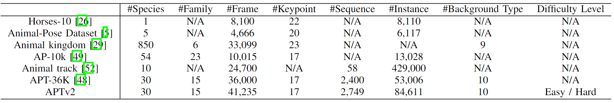
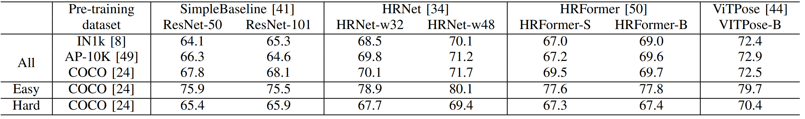
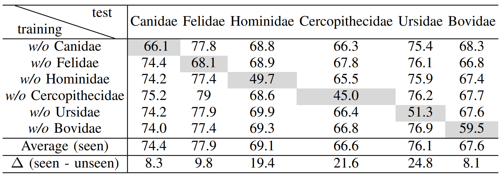
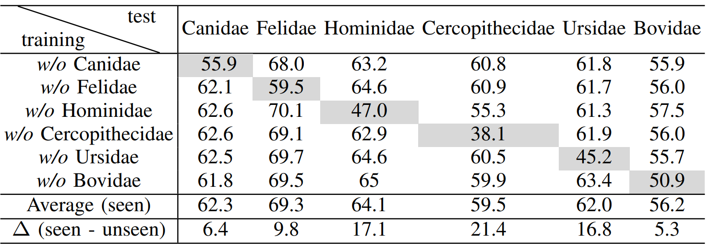
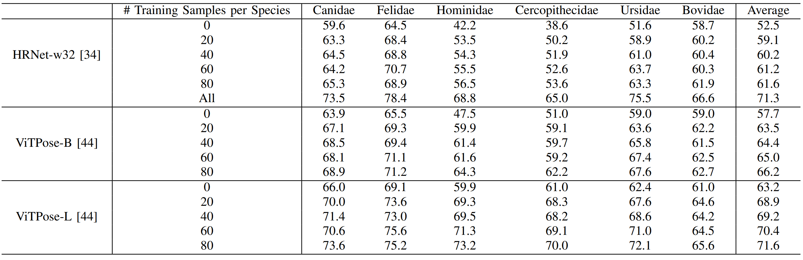
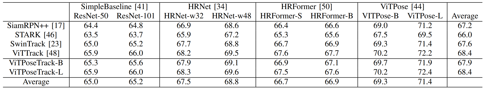
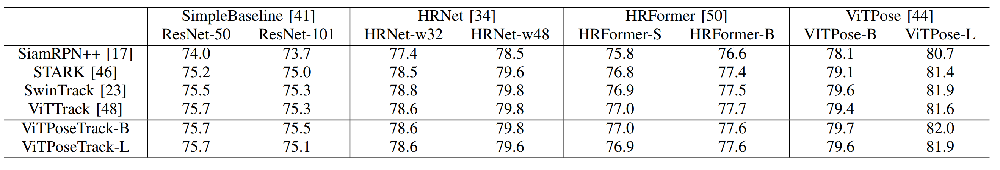
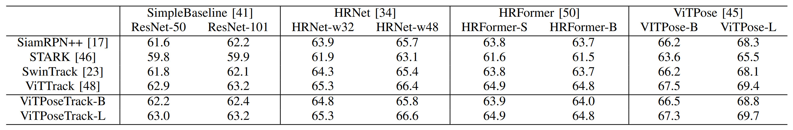
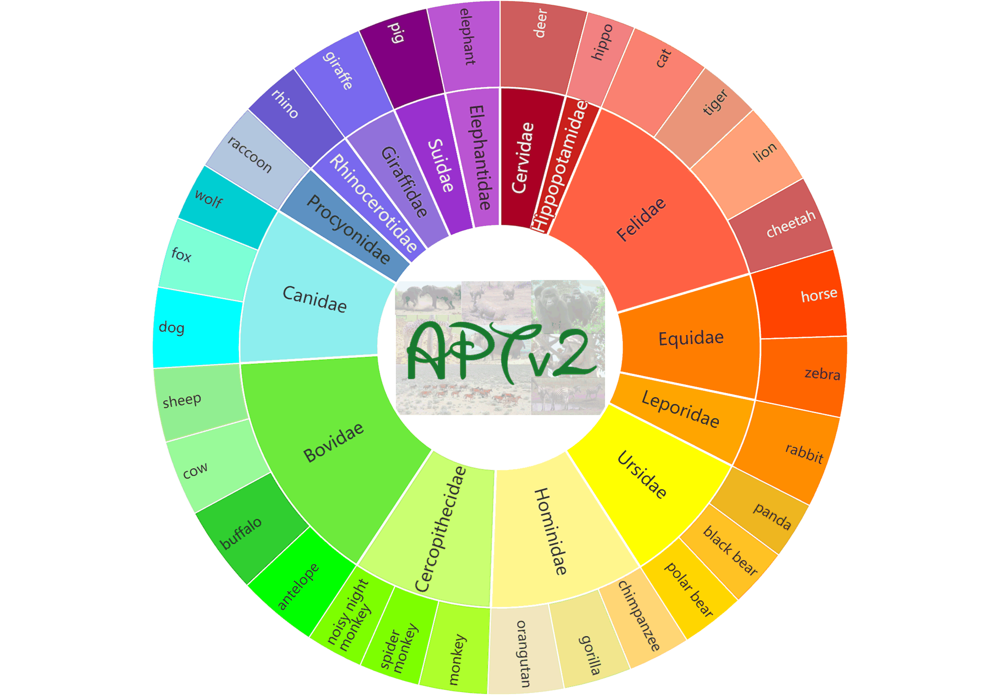
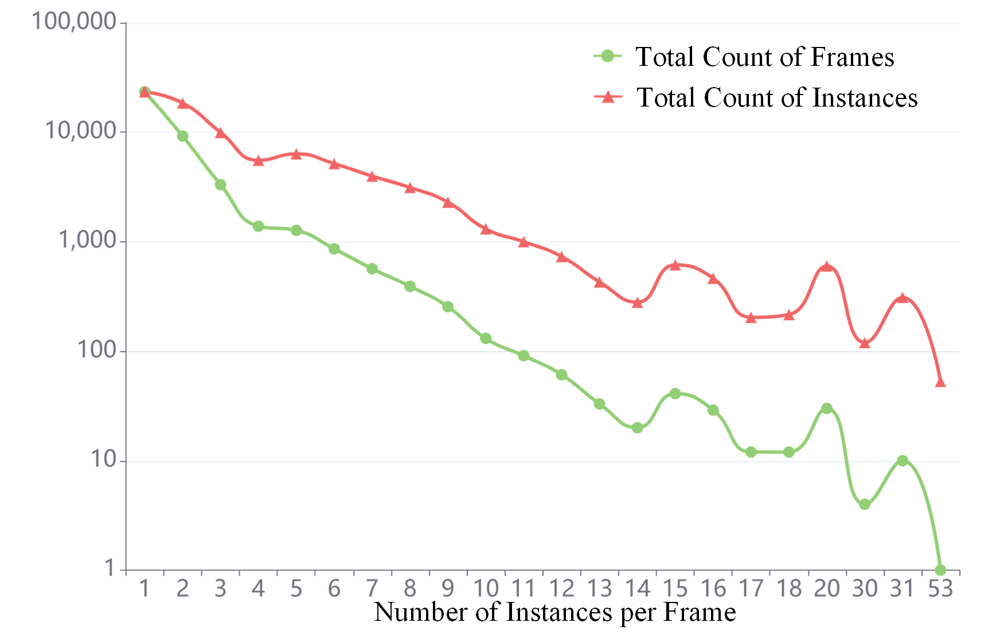

<h1 align="center"> APTv2: Benchmarking Animal Pose Estimation and Tracking with a Large-scale Dataset and BeyondScenes </h1>
<p align="center">
</p>
<h5 align="center"><em>Yuxiang Yang, Yufei Xu, Yingqi Deng, Jing Zhang</em></h5>
<p align="center">
  <a href="#news">News</a> |
  <a href="#introduction">Abstract</a> |
  <a href="#usage">Usage</a> |
  <a href="#results">Results</a> |
  <a href="#statement">Statement</a>
</p>

# Introduction
<p>

<p align="justify">Animal  Pose  Estimation  and  Tracking  (APT)  is  
a critical task in detecting and monitoring the keypoints of  
animals across a series of video frames, which is essential for  
understanding animal behavior. Past works relating to animals  
have primarily focused on either animal tracking or single-frame  
animal pose estimation only, neglecting the integration of both  
aspects. The absence of comprehensive APT datasets inhibits  
the progression and evaluation of animal pose estimation and  
tracking methods based on videos, thereby constraining their  
real-world applications. To fill this gap, we introduce APTv2,  
the pioneering large-scale benchmark for animal pose estimation  
and tracking. APTv2 comprises 2,749 video clips filtered and  
collected from 30 distinct animal species. Each video clip includes  
15 frames, culminating in a total of 41,235 frames. Following  
meticulous  manual  annotation  and  stringent  verification,  we  
provide high-quality keypoint and tracking annotations for a total  
of 84,611 animal instances, split into easy and hard subsets based  
on the number of instances that exists in the frame. With APTv2  
as the foundation, we establish a simple baseline method named  
ViTPoseTrack and provide benchmarks for representative models  
across three tracks: (1) single-frame animal pose estimation track  
to evaluate both intra- and inter-domain transfer learning perfor-  
mance, (2) low-data transfer and generalization track to evaluate  
the inter-species domain generalization performance, and (3)  
animal pose tracking track. Our experimental results deliver key  
empirical insights, demonstrating that APTv2 serves as a valuable  
benchmark for animal pose estimation and tracking.
  
# Results
## The comparison information of relevant datasets


<p align="justify">A comprehensive comparison between our APTv2 and existing datasets.<p>

## The performances of representative methods


<p align="justify">Result(AP) of different models on the SF track of APTv2 with IMAGENET-1K (IN1K) , MS COCO, and AP-10K pre-training,respectively.ALL, EASY,and HARD denote the entire validation set, and its east and hard subsets,respectively.<p>



<p align="justify">The "Leave One Out" setting of APTv2<p>



<p align="justify">The "Leave One Out" setting of APTv2 where only easy subset used for training<p>



<p align="justify">The "Low Data Fine-Tuning" setting of APTv2<p>



<p align="justify">The tracking result of different models on the APTv2 validation set<p>



<p align="justify">The tracking result of different models on the easy validation set<p>



<p align="justify">The tracking result of different models on the hard validation set<p>

## Dataset Statistics and Analysis


<p align="justify">APTv2 covers 30 distinct animal species across 15 different families. It features a significant number of annotated frames with numerous annotated animal instances from a large collection of video clips.<p>


<p align="justify">APTv2 contains more hard instances per animal species compared with the easy counterpart, posing more challenges on the animal pose estimation and tracking tasks.<p>



<p align="justify">APTv2 exhibits a long-tail distribution concerning the frequency of instances per frame, i.e., certain frames contain a high number of animal instances, reaching up to 53.<p>


## Statement

<p align="justify">If you are interested in our work, please consider citing the following:</p>

```
@inproceedings{yangapt,
  title={APT-36K: A Large-scale Benchmark for Animal Pose Estimation and Tracking},
  author={Yang, Yuxiang and Yang, Junjie and Xu, Yufei and Zhang, Jing and Lan, Long and Tao, Dacheng},
  booktitle={Thirty-sixth Conference on Neural Information Processing Systems Datasets and Benchmarks Track}
}
```
<p align="justify">This project is under MIT licence.</p>


## Relevant Projects

[1] <strong>APT-36K: A Large-scale Benchmark for Animal Pose Estimation and Tracking, Neurips, 2022</strong>
| [Paper](https://proceedings.neurips.cc/paper_files/paper/2022/file/6e566c91d381bd7a45647d9a90838817-Paper-Datasets_and_Benchmarks.pdf) | [Github](https://github.com/pandorgan/APT-36K) |
Yuxiang Yang , Junjie Yang , Yufei Xu , Jing Zhang, Long Lan, Dacheng Tao

