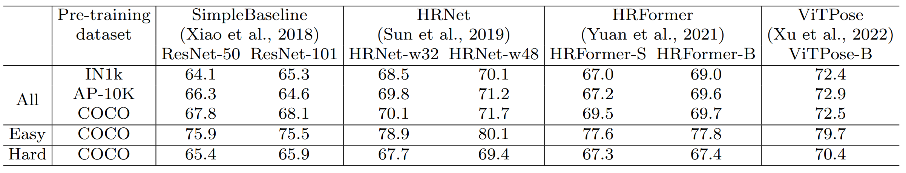
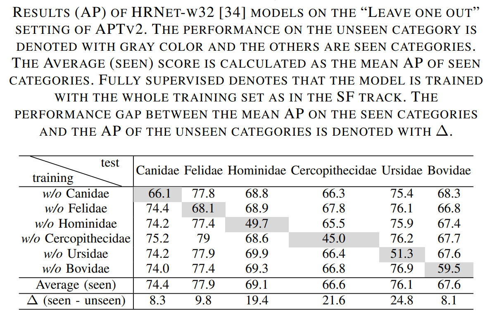
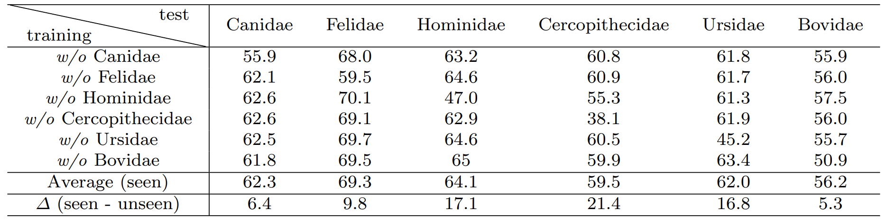
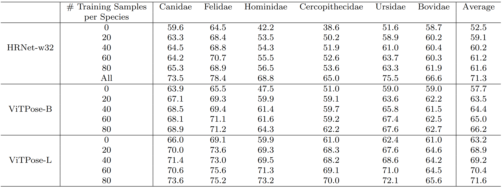
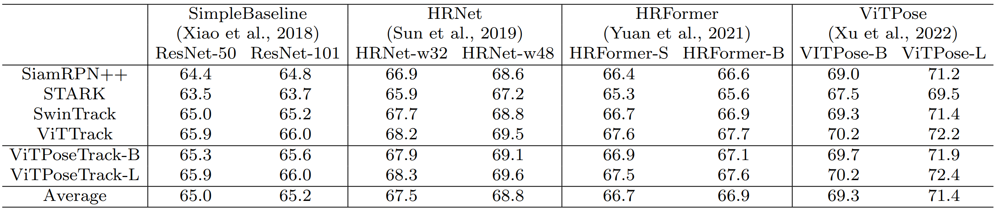

<h1 align="center"> APTv2 </h1>
<p align="center">
  <a href="https://arxiv.org/abs/2312.15612">.svg" ></a>
</p>
<p align="center">
  <a href="#introduction">Introduction</a> |
  <a href="#results">Results</a> |
  <a href="#statement">Statement</a> |
</p>


| Dataset | <p>Dataset Link<br>(OneDrive)</p> | <p>ModelZoo Link<br>(OneDrive)</p> |
 | :----:| :----: | :----: |
 |<strong>APTv2</strong>|[Link](https://1drv.ms/f/s!AimBgYV7JjTlgckmLjVg2Z7B3DZXeQ?e=1gVLFe)|[Link](https://1drv.ms/f/s!AimBgYV7JjTlgchy6avyLWkksXeNJQ?e=t1iTNm)|

# Introduction
<p>

<p align="justify">APTv2 is an extension of APT-36K, increasing the number of animal instances from  53,006  to 84,611. We split APTv2 into easy and hard subsets based  on the number of instances that exists in the frame. 
  
# Results
## The performances of representative methods

<figure>
<figcaption align = "center"><b>Result(AP) of different models on the SF track of APTv2 with IMAGENET-1K (IN1K) , MS COCO, and AP-10K pre-training,respectively.ALL, EASY,and HARD denote the entire validation set, and its east and hard subsets,respectively.</a>  
 </b></figcaption>
 
</figure>

<figure>
<figcaption align = "center"><b>Results (AP) of HRNet-w32 (Sun et al., 2019) models on the “Leave one out” setting of APTv2. The Average (seen) score is calculated as the mean AP of seen categories. Fully supervised denotes that the model is trained with the whole training set as in the SF track. The performance gap between the mean AP on the seen categories and the AP of the unseen categories is denoted with ∆.</a>  
 </b></figcaption>
 
</figure>

<figure>
<figcaption align = "center"><b>Results (AP) of HRNet-w32 (Sun et al., 2019) models on the “Leave one out” setting of APTv2, where
only easy subset is used for training.</a>  
 </b></figcaption>
 
</figure>


<figure>
<figcaption align = "center"><b>The "Results (AP) of HRNet-w32 (Sun et al., 2019), ViTPose-B (Xu et al., 2022), ViTPose-L (Xu et al., 2022) in the “low-data fine-tuning” setting.</a>  
 </b></figcaption>
 
</figure>

<figure>
<figcaption align = "center"><b>The tracking results of SiamRPN++ (Li et al., 2019a), STARK (Yan et al., 2021), SwinTrack (Lin et al., 2021), ViTTrack (Yang et al., 2022) on the APTv2 validation set.</a>  
 </b></figcaption>
 
</figure>

## Statement

<p align="justify">If you are interested in our work, please consider citing the following:</p>

```
@misc{yang2023aptv2,
      title={APTv2: Benchmarking Animal Pose Estimation and Tracking with a Large-scale Dataset and Beyond}, 
      author={Yuxiang Yang and Yingqi Deng and Yufei Xu and Jing Zhang},
      year={2023},
      eprint={2312.15612},
      archivePrefix={arXiv},
      primaryClass={cs.CV}
}
```
<p align="justify">This project is under MIT licence.</p>
